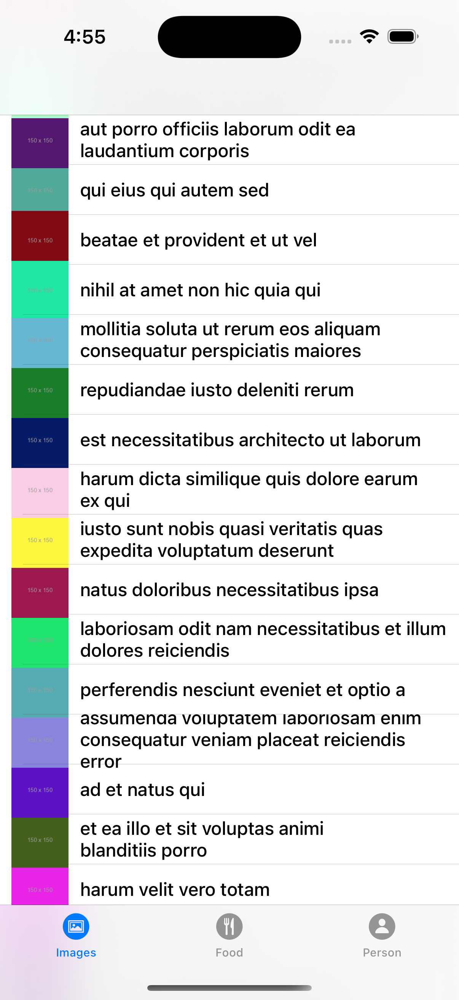
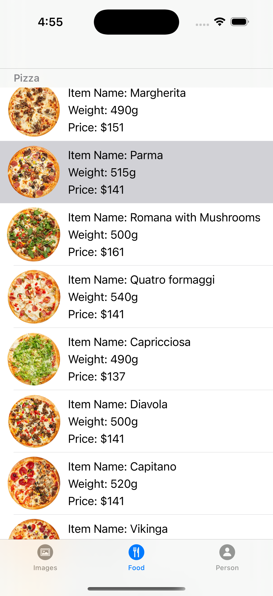
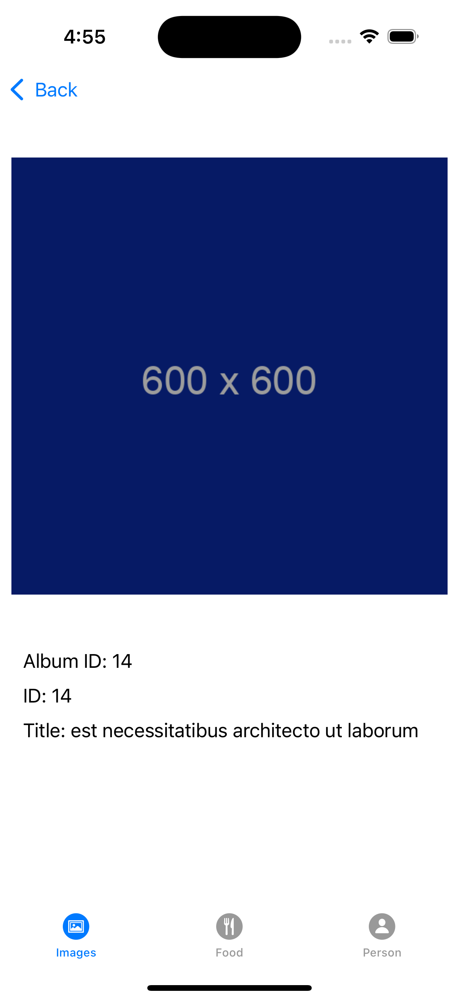
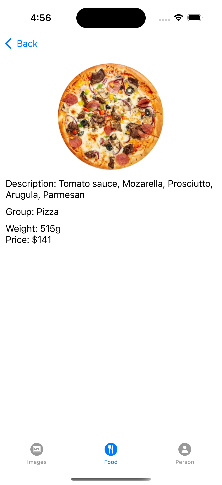
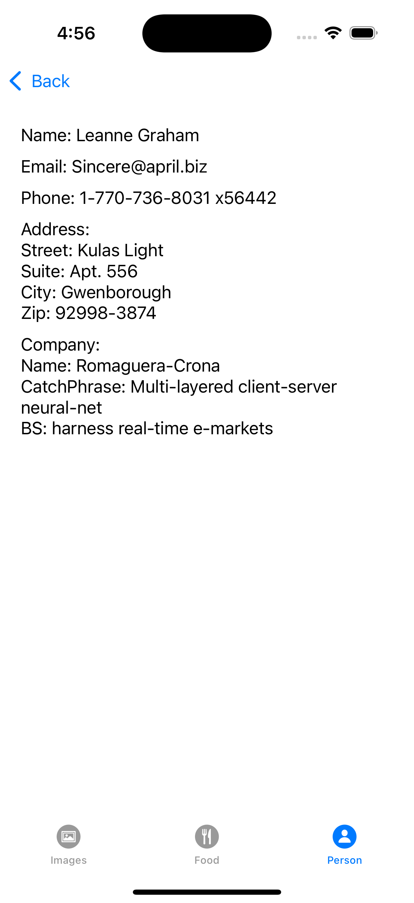

# TabBar API Integration App

A Swift-based iOS application that demonstrates the use of multiple APIs and showcases data in a tabbed interface. The app consists of three main tabs, each displaying data fetched from different APIs. Users can navigate to detailed views for each item by selecting rows in the table view.

## Features

- **TabBar Navigation**: The app has three tabs: Images, Food, and Persons.
- **API Integration**: Data is fetched from three different APIs using `async` and `await` with proper error handling.
- **Table Views**:
  - **Images Tab**: Displays image thumbnails and titles fetched from an API. Users can tap on a row to see the full image and details.
  - **Food Tab**: Displays food item names, weights, and prices. Users can tap a row to see a detailed view with the image, description, and additional details.
  - **Persons Tab**: Displays the names and email addresses of persons fetched from an API. Users can tap a row to see detailed information about the person.
- **Detailed Views**: Each tab provides a detailed view for selected items with all relevant information presented cleanly.

## Screenshots


### Images Tab



### Food Tab



### Persons Tab


### Detailed View: Image



### Detailed View: Food



### Detailed View: Person



## Technical Details

- **Programming Language**: Swift
- **UI Framework**: UIKit
- **Network Calls**: `URLSession` with `async` and `await`
- **Data Parsing**: Codable structs for JSON decoding
- **Image Caching**: NSCache used for efficient image loading and caching
- **Architecture**: 
  - `UITableView` for list views
  - Custom cells for dynamic content rendering
  - `UINavigationController` for navigation to detailed views
- **Screens**:
  - **Images Tab**: Fetches image data from an API and displays thumbnails with titles.
  - **Food Tab**: Fetches food data and displays item names, weights, and prices. Detailed view includes an image and a description.
  - **Persons Tab**: Fetches person data and displays names and email addresses. Detailed view includes additional information like address and company details.

## APIs Used

1. **Images API**: Fetches a list of images.
   - URL: `https://jsonplaceholder.typicode.com/photos`

2. **Food API**: Fetches food item details.
   - URL: `https://example.com/api/foods`

3. **Persons API**: Fetches user details.
   - URL: `https://jsonplaceholder.typicode.com/users`

## How to Run the Project

1. Clone the repository:
   ```bash
   git clone https://github.com/your-username/TabBarAPIIntegration.git
   cd TabBarAPIIntegration
